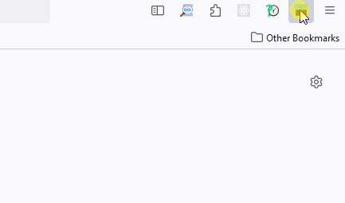
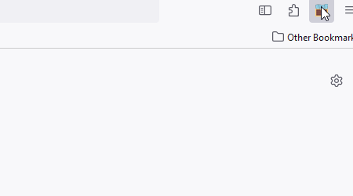
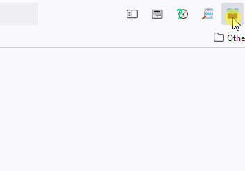
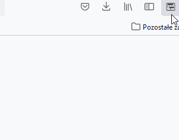

<h1 align="center"> Session Storage </h1>

    Keep your browsing sessions in memory, don't loose your work and don't be afraid to close the browser.

    
    
    

This project is the Mozilla Firefox extension plugin.
 It's purpose is to keep all your opened tabs in memory so you won't be afraid to close your browser or to start a new session.

The idea is to have a simple plugin (being available in the upper-right corner) that will allow you to:
* Save the current session (of current window) under specific ID or customized key
* Reopen selected session in a new browser window
* Manage your saved sessions by deleting it or modifying

---
  
## Installation & Usage ##

This extension can be installed by:
* installing it via the Mozilla add-ons market by clicking the button bellow: 
* downloading it directly from the [Releases page](https://github.com/BartoszKlonowski/session-storage/releases) and install it manually in your browser

After successful installation you will see the extension icon in the upper-right corner of your browser.
Popup that appears allows to do four actions:
| | | |
|:-:|:-|:-:|
| **Save** | Saves all tabs of the current window under the name specified in the input on the left. The name itself is also saved in memory, so that it's easier to select it later. |  |
| **Edit** | Edits the selected session (the one which name was selected/entered in the text field input). The edit action is available under the *SAVE* button. Note that this action completely overwrites the selected session with all the tabs currently opened in current window. **NOTE**: This action can't be reverted - each session is saved without it's change revisions/history. |  |
| **Delete** | Removes the session which name was entered/selected in the text field input. Name of deleted session will also be removed so only the existing sessions will be availble to be selected. **NOTE**: If name of a non-existing session will be entered to be deleted this action takes no effect. |  |
| **Reopen** | Opens all tabs previously saved under the selected/entered session's name. All tabs of reopened session are created in the **current** window, so the advice is to reopen a session in a new window to avoid mixing various sessions |  |

---

## Contributing ##

If you would like to contribute to the *SessionStorage* project, you are more than welcome!
 Any contribution is to make the project better and to improve the user's experience.
 So if you'd like to contribute, you can do this in one of the following ways:

* Create an [Issue](https://github.com/BartoszKlonowski/session-storage/issues/new) and let the author handle it
 Each issue created in the [Issues](https://github.com/BartoszKlonowski/session-storage/issues) section gives a chance of improving the project and make it even more useful.
* Create the [Pull Request](https://github.com/BartoszKlonowski/session-storage/compare) with the desired changes (please see further for how to develop this extension).
 After a detailed review it will be merged.
 Please remember to give the detailed description of why such change is needed, what is the test plan and what are the details of your implementation. This will make the review easier and quicker.
 Please also remember to check the unit tests and implement additional tests in case of providing the project with some new features/new code.

---

## Development ##

If you plan to implement changes to this extension:

1. Clone your fork of this repository
2. Run `npm install` in the root of this repository to install all the dependencies and tools Please make sure to have the `npm` installed first.
3. Implement your changes and test them:
 Manually by following [these steps](https://extensionworkshop.com/documentation/develop/debugging/)
 Or automatically by running `npm run-script test` and `npm run-script build` in the root of your clone

---

## Thank you! ##

If you like this project, or you find it helpful, please share your opinion with the author or just give it a star!
