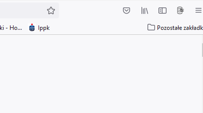

<h1 align="center"> Session Storage </h1>

    Keep your browsing sessions in memory, don't loose your work and don't be afraid to close the browser.

    
    
    

This project is the Mozilla Firefox extension plugin.
 It's created to keep all your opened tabs in memory so you won't be afraid to close your browser or to start a new session.

The idea is to have a simple plugin (being available in the upper-right corner) that will allow you to:
* Save the current session under specific ID or customized key
* Reopen selected session in a new browser window
* Manage your saved sessions by deleting it or modifying
  

---
  
## Installation & Usage ##

You can use this extension by:
* downloading it directly from the [Releases page](https://github.com/BartoszKlonowski/session-storage/releases) and install it manually in your browser
> Official package will appear in the browser add-ons market only after v1.0.0 release.
> Please stay tuned!
>* installing it via the Mozilla add-ons market under the [following link](https://addons.mozilla.org/pl/firefox/addon/SessionStorage/) to the officialy published package

After successful installation you will see the extension icon in the upper-right corner of your browser.
Click it for the popup to appear and use it just like presented below:

---

## Documentation ##

This plugin is easy to use and most user-friendly, but to improve the user-experience even more everything you need to know about this tool can be found in the [Wiki](https://github.com/BartoszKlonowski/session-storage/wiki).
 Feel free to open an [issue](https://github.com/BartoszKlonowski/session-storage/issues) if there's anything unclear.

---

## Contributing ##

If you would like to contribute to the *SessionStorage* project, you are more than welcome!
 Any contribution is to make the project better and to improve the user's experience.
 So if you'd like to contribute, you can do this in one of the following ways:

* Create an [Issue](https://github.com/BartoszKlonowski/session-storage/issues/new) and let the author handle it
 Each issue created in the [Issues](https://github.com/BartoszKlonowski/session-storage/issues) section gives a chance of improving the project and make it even more useful.
* Create the [Pull Request](https://github.com/BartoszKlonowski/session-storage/compare) with the desired changes
 After a detailed review it will be merged.
 Please remember to give the detailed description of why such change is needed, what is the test plan and what are the details of your implementation. This will make the review easier and quicker.
 Please also remember to check the unit tests and implement additional tests in case of providing the project with some new features/new code.

---

## Thank you! ##

If you like this project, or you find it helpful, please share your opinion with the author or just give it a star!
